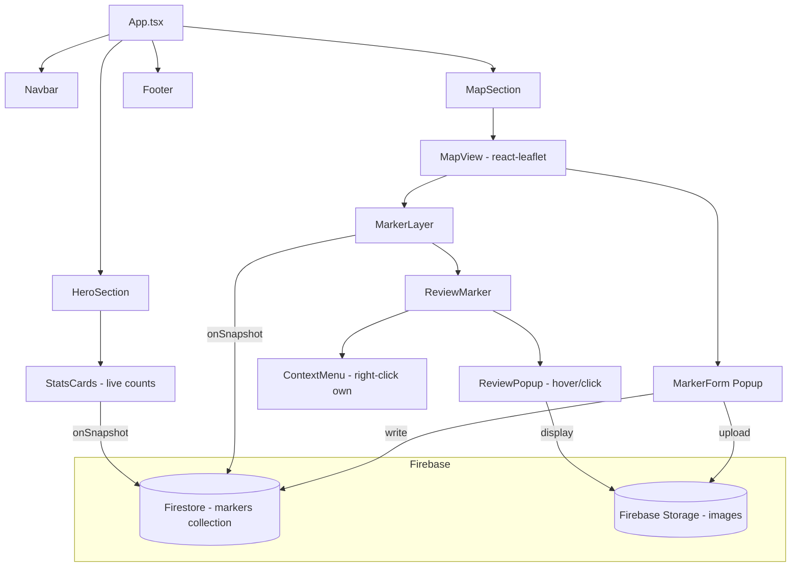
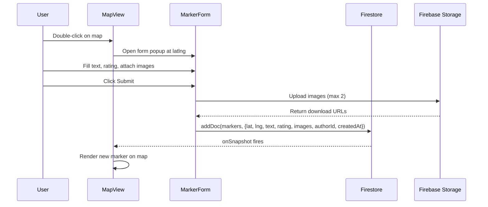
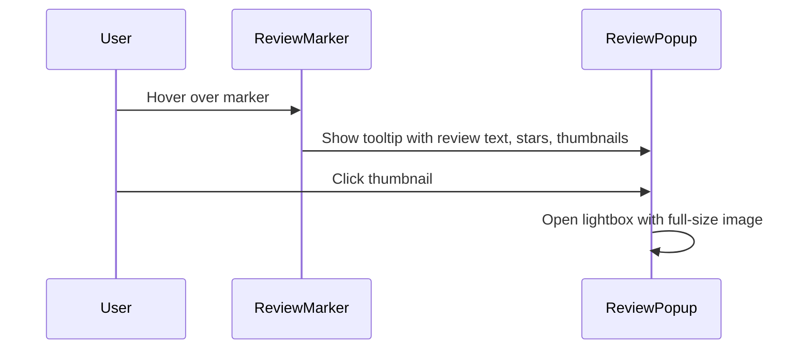
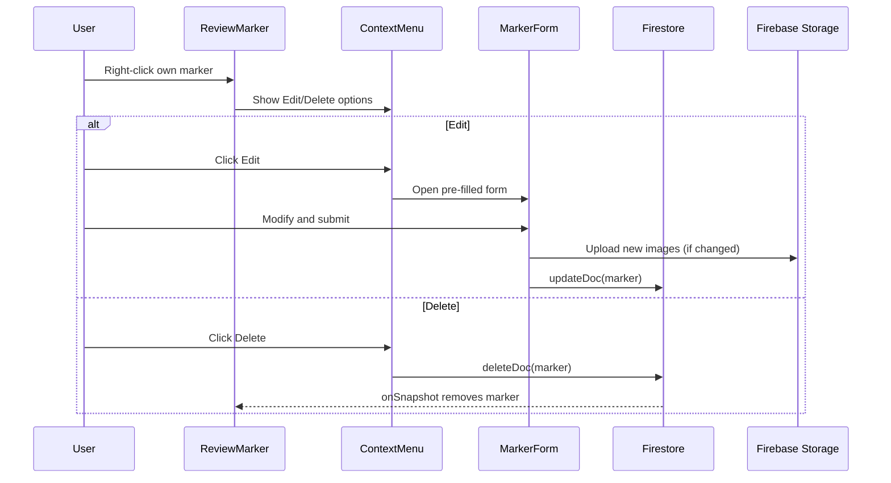

# Design Document: Interactive Map with Reviews

## Overview

This feature replaces the static map image in the Ateneo Food Guide with a fully interactive Leaflet map powered by real-time Firestore data. Users can double-click to place review markers with text, star ratings, and images. Markers are stored in Firestore and synced in real-time via `onSnapshot`. User identity is managed via a localStorage UUID — no auth system. Marker ownership determines color and edit/delete capabilities via right-click context menu. Firebase Storage handles image uploads, and the hero stat cards reflect live Firestore counts.

## Architecture



## Sequence Diagrams

### Creating a New Marker



### Viewing a Marker (Hover)



### Editing/Deleting Own Marker



## Components and Interfaces

### Component: FirebaseConfig

**Purpose**: Initialize and export Firebase app, Firestore, and Storage instances.

```typescript
// src/firebase.ts
import { initializeApp } from 'firebase/app'
import { getFirestore } from 'firebase/firestore'
import { getStorage } from 'firebase/storage'

const firebaseConfig = {
  apiKey: import.meta.env.VITE_API_KEY,
  authDomain: import.meta.env.VITE_AUTH_DOMAIN,
  projectId: import.meta.env.VITE_PROJECT_ID,
  storageBucket: import.meta.env.VITE_STORAGE_BUCKET,
  messagingSenderId: import.meta.env.VITE_MESSAGING_SENDER_ID,
  appId: import.meta.env.VITE_APP_ID,
  measurementId: import.meta.env.VITE_MEASUREMENT_ID,
}

const app = initializeApp(firebaseConfig)
export const db = getFirestore(app)
export const storage = getStorage(app)
```

**Responsibilities**:
- Single source of truth for Firebase initialization
- Export `db` and `storage` for use across the app

### Component: UserIdentity

**Purpose**: Generate and persist a UUID in localStorage for marker ownership.

```typescript
// src/utils/userId.ts
export function getUserId(): string {
  const key = 'ateneo-food-guide-user-id'
  let id = localStorage.getItem(key)
  if (!id) {
    id = crypto.randomUUID()
    localStorage.setItem(key, id)
  }
  return id
}
```

**Responsibilities**:
- Generate UUID on first visit
- Persist across sessions via localStorage
- Return consistent ID for ownership checks

### Component: MapView

**Purpose**: Renders the interactive Leaflet map, handles double-click for new markers.

```typescript
interface MapViewProps {
  markers: MarkerData[]
  currentUserId: string
  onMapDoubleClick: (latlng: LatLng) => void
  onMarkerEdit: (marker: MarkerData) => void
  onMarkerDelete: (markerId: string) => void
}
```

**Responsibilities**:
- Render Leaflet map centered on Ateneo de Davao Jacinto Campus
- Handle double-click events to trigger marker creation
- Render all markers with appropriate colors (blue for own, red for others)
- Pass marker interactions to parent

### Component: ReviewMarker

**Purpose**: Individual marker on the map with hover popup and right-click context menu.

```typescript
interface ReviewMarkerProps {
  marker: MarkerData
  isOwn: boolean
  onEdit: (marker: MarkerData) => void
  onDelete: (markerId: string) => void
}
```

**Responsibilities**:
- Display marker with color based on ownership
- Show tooltip on hover with review snippet, stars, thumbnails
- Show context menu on right-click (only if own marker)
- Trigger edit/delete actions

### Component: MarkerForm

**Purpose**: Form popup for creating or editing a marker review.

```typescript
interface MarkerFormProps {
  position: LatLng | null
  existingMarker?: MarkerData | null
  onSubmit: (data: MarkerFormData) => Promise<void>
  onCancel: () => void
}

interface MarkerFormData {
  text: string
  rating: number
  images: File[]
}
```

**Responsibilities**:
- Text input for review message
- 5-star interactive rating selector
- Image attachment (max 2 files)
- Submit/cancel actions
- Pre-fill when editing

### Component: StarRating

**Purpose**: Reusable clickable 5-star rating widget.

```typescript
interface StarRatingProps {
  value: number
  onChange?: (rating: number) => void
  readonly?: boolean
}
```

**Responsibilities**:
- Display 1-5 filled/empty stars
- Handle click to set rating (when not readonly)
- Visual-only display for popups (readonly mode)

### Component: ImageLightbox

**Purpose**: Full-size image viewer triggered by clicking thumbnails.

```typescript
interface ImageLightboxProps {
  imageUrl: string
  onClose: () => void
}
```

**Responsibilities**:
- Display full-size image in a modal overlay
- Close on click outside or close button

### Component: HeroSection (Updated)

**Purpose**: Display live stat counts from Firestore.

```typescript
interface HeroSectionProps {
  reviewCount: number
  markerCount: number
  contributorCount: number
}
```

**Responsibilities**:
- Show live counts sourced from Firestore `markers` collection
- Reviews = total marker count (each marker is a review)
- Map Markers = total marker count
- Contributors = count of distinct `authorId` values

## Data Models

### MarkerData (Firestore Document)

```typescript
interface MarkerData {
  id: string                // Firestore document ID
  lat: number              // Latitude
  lng: number              // Longitude
  text: string             // Review text
  rating: number           // 1-5 star rating
  images: string[]         // Firebase Storage download URLs (0-2)
  authorId: string         // UUID from localStorage
  createdAt: Timestamp     // Firestore server timestamp
}
```

**Validation Rules**:
- `lat` must be valid latitude (-90 to 90)
- `lng` must be valid longitude (-180 to 180)
- `text` must be non-empty string, max 500 characters
- `rating` must be integer 1-5
- `images` array max length 2
- `authorId` must be non-empty string (UUID format)

### Firestore Collection Structure

```
markers/
  {docId}/
    lat: number
    lng: number
    text: string
    rating: number
    images: string[]
    authorId: string
    createdAt: timestamp
```

### Firebase Storage Structure

```
marker-images/
  {markerId}/
    {filename}
```

## Key Functions with Formal Specifications

### Function: subscribeToMarkers

```typescript
function subscribeToMarkers(
  callback: (markers: MarkerData[]) => void
): Unsubscribe
```

**Preconditions:**
- Firebase is initialized and `db` is available
- `callback` is a valid function

**Postconditions:**
- Returns an unsubscribe function
- Callback is invoked immediately with current markers
- Callback is invoked on every subsequent change to the `markers` collection
- Each `MarkerData` in the array has a valid `id` field from Firestore

**Loop Invariants:** N/A

### Function: createMarker

```typescript
async function createMarker(
  data: MarkerFormData,
  position: LatLng,
  authorId: string
): Promise<string>
```

**Preconditions:**
- `data.text` is non-empty and ≤ 500 characters
- `data.rating` is integer in range [1, 5]
- `data.images` has length ≤ 2
- `position` has valid lat/lng values
- `authorId` is non-empty UUID string

**Postconditions:**
- Returns the new document ID
- Document exists in Firestore `markers` collection
- All images uploaded to Firebase Storage with valid download URLs
- `createdAt` is set to server timestamp

### Function: updateMarker

```typescript
async function updateMarker(
  markerId: string,
  data: MarkerFormData,
  authorId: string
): Promise<void>
```

**Preconditions:**
- `markerId` references an existing document
- The document's `authorId` matches the provided `authorId`
- `data` meets same validation as `createMarker`

**Postconditions:**
- Document is updated with new text, rating, and images
- Old images not in the new set are deleted from Storage
- `createdAt` is preserved (not modified)

### Function: deleteMarker

```typescript
async function deleteMarker(
  markerId: string,
  authorId: string
): Promise<void>
```

**Preconditions:**
- `markerId` references an existing document
- The document's `authorId` matches the provided `authorId`

**Postconditions:**
- Document is removed from Firestore `markers` collection
- Associated images are deleted from Firebase Storage
- Marker disappears from all connected clients via onSnapshot

### Function: uploadMarkerImages

```typescript
async function uploadMarkerImages(
  markerId: string,
  files: File[]
): Promise<string[]>
```

**Preconditions:**
- `files` has length ≤ 2
- Each file is a valid image (JPEG, PNG, WebP)
- `markerId` is a valid string identifier

**Postconditions:**
- Returns array of download URLs equal in length to input files
- Each file is uploaded to `marker-images/{markerId}/{filename}`
- URLs are publicly accessible

### Function: getStats

```typescript
function subscribeToStats(
  callback: (stats: { reviews: number; markers: number; contributors: number }) => void
): Unsubscribe
```

**Preconditions:**
- Firebase is initialized and `db` is available

**Postconditions:**
- `reviews` equals total document count in `markers` collection
- `markers` equals total document count in `markers` collection
- `contributors` equals count of distinct `authorId` values across all markers
- Updates in real-time as markers are added/removed

## Example Usage

```typescript
// Initialize user identity
const userId = getUserId() // "a3f2c1d4-..."

// Subscribe to markers
useEffect(() => {
  const unsubscribe = subscribeToMarkers((markers) => {
    setMarkers(markers)
  })
  return unsubscribe
}, [])

// Create a new marker on double-click
const handleMapDoubleClick = async (latlng: LatLng) => {
  setFormPosition(latlng)
  setShowForm(true)
}

const handleFormSubmit = async (data: MarkerFormData) => {
  await createMarker(data, formPosition, userId)
  setShowForm(false)
}

// Determine marker color
const getMarkerColor = (marker: MarkerData) =>
  marker.authorId === userId ? 'blue' : 'red'

// Right-click context menu (own markers only)
const handleMarkerRightClick = (marker: MarkerData, e: MouseEvent) => {
  if (marker.authorId === userId) {
    showContextMenu(e, marker)
  }
}
```

## Error Handling

### Error Scenario 1: Image Upload Failure

**Condition**: Firebase Storage upload fails (network error, quota exceeded)
**Response**: Display error message to user, do not save the marker
**Recovery**: User can retry submission; previously uploaded images for this attempt are cleaned up

### Error Scenario 2: Firestore Write Failure

**Condition**: Firestore addDoc/updateDoc/deleteDoc fails
**Response**: Display error toast/notification to user
**Recovery**: Form remains open with data preserved; user can retry

### Error Scenario 3: Real-time Listener Disconnection

**Condition**: onSnapshot listener loses connection
**Response**: Map continues showing last known state
**Recovery**: Listener automatically reconnects when network is restored (Firebase SDK handles this)

### Error Scenario 4: Invalid Form Input

**Condition**: User submits empty text, no rating, or more than 2 images
**Response**: Form shows inline validation errors, submit button disabled
**Recovery**: User corrects input and resubmits

### Error Scenario 5: Unauthorized Edit/Delete Attempt

**Condition**: User attempts to edit/delete a marker they don't own
**Response**: Context menu is not shown for non-owned markers (prevented at UI level)
**Recovery**: N/A — the action is prevented before it can occur

## Testing Strategy

### Unit Testing Approach

- Test `getUserId()` generates and persists UUID correctly
- Test marker validation logic (text length, rating range, image count)
- Test ownership check logic (authorId comparison)
- Test stat computation (distinct contributors count)

### Property-Based Testing Approach

**Property Test Library**: fast-check

- Validate marker data invariants across random inputs
- Test that ownership coloring is consistent
- Test form validation rejects all invalid inputs and accepts all valid ones

### Integration Testing Approach

- Test Firestore CRUD operations with emulator
- Test image upload/download cycle
- Test real-time subscription delivers updates

## Performance Considerations

- Leaflet map tiles loaded on demand (tile-based rendering)
- Firestore `onSnapshot` keeps a persistent connection — efficient for real-time updates
- Images stored as thumbnails + full-size (consider resizing before upload for bandwidth)
- Marker clustering could be added later if marker count grows large (not in v1)
- UUID generation uses native `crypto.randomUUID()` — no external dependency

## Security Considerations

- No authentication — Firestore rules allow open read/write until Aug 2026
- Ownership is localStorage-based (can be spoofed by clearing storage or copying UUID)
- Image uploads should validate file type and size client-side before upload
- No server-side enforcement of ownership (acceptable for a student project with open Firestore rules)
- Rate limiting not implemented (rely on Firebase quotas)

## Dependencies

- `react-leaflet` + `leaflet` — Map rendering and interaction
- `firebase` (v9+ modular) — Firestore real-time listeners, Storage uploads
- `@types/leaflet` — TypeScript types for Leaflet
- No additional UI libraries — use existing CSS design system
- No routing library — single-page with sections

## Correctness Properties

*A property is a characteristic or behavior that should hold true across all valid executions of a system — essentially, a formal statement about what the system should do. Properties serve as the bridge between human-readable specifications and machine-verifiable correctness guarantees.*

### Property 1: Marker data round-trip consistency

For any valid MarkerData object written to Firestore, reading it back via onSnapshot should produce an equivalent object (same lat, lng, text, rating, images, authorId).

**Validates: Requirements 2.5, 2.6, 4.2**

### Property 2: Ownership color determinism

For any marker and any userId, the marker color is blue if and only if marker.authorId equals userId, and red otherwise. This must be consistent regardless of other state.

**Validates: Requirements 6.2, 6.3**

### Property 3: Form validation rejects all invalid inputs

For any MarkerFormData where text is empty/whitespace-only OR rating is outside [1,5] OR images count exceeds 2, the validation function must return false.

**Validates: Requirements 3.1, 3.2, 3.3**

### Property 4: Form validation accepts all valid inputs

For any MarkerFormData where text is non-empty (after trim) AND rating is in [1,5] AND images count is ≤ 2, the validation function must return true.

**Validates: Requirements 3.4**

### Property 5: Distinct contributor count accuracy

For any collection of markers, the contributor count equals the number of distinct authorId values across all markers in the collection.

**Validates: Requirements 8.3**

### Property 6: Context menu visibility is ownership-gated

For any marker and any userId, the context menu (edit/delete) is shown if and only if marker.authorId equals userId. For all other markers, right-click produces no context menu.

**Validates: Requirements 7.1, 7.2**
